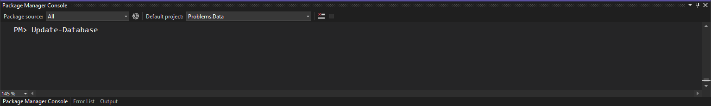
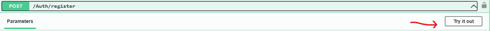
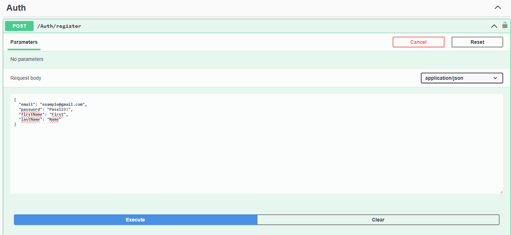
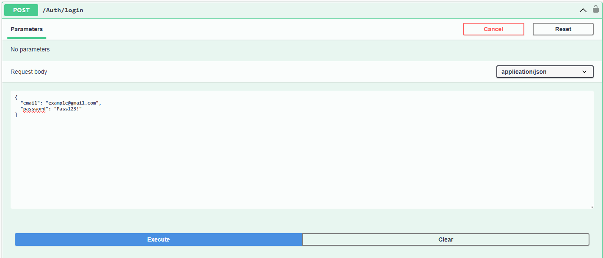
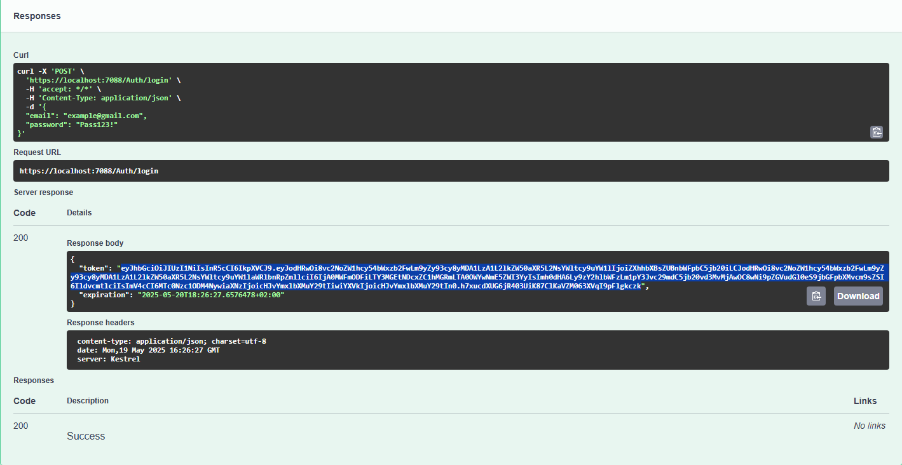
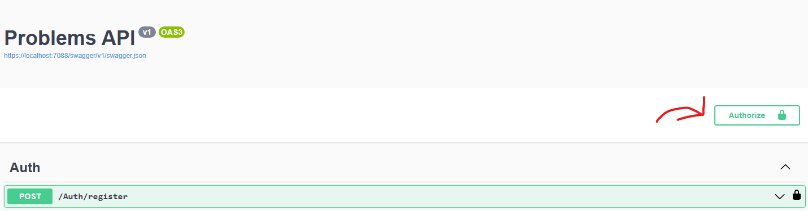
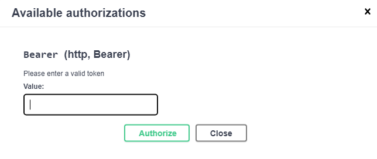
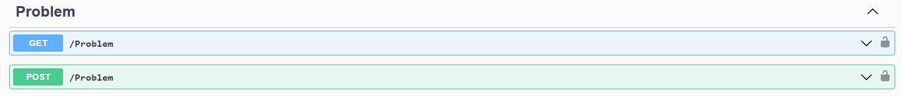

# Ticket-Collector

This Project was Created with Visual Studio.  
You can use the .sln file to open the whole project, where you can build and run the app automatically.  
Make sure to Update-Database, you can do it inside the package manager console, otherwise the program won't work. The Migration's are located in Problems.Data, make sure to select it inside the console as Default project.  
  

First you can register an account, the first one will be the Admin user. Use the "Try it out" button inside swagger.  
  

Be sure to give a strong password with Uppercase,lowercase,number and special character, otherwise the POST will fail.  
  

Next, you should login like this  
  

Than use the token generated to authorize yourself in, otherwise you wont't get permission to use the other functions.  
  

  

Than paste the token inside  
  

After this feel free to post problems and read with GET. Only the Admin can Read/GET, everyone else can only post problems.  

